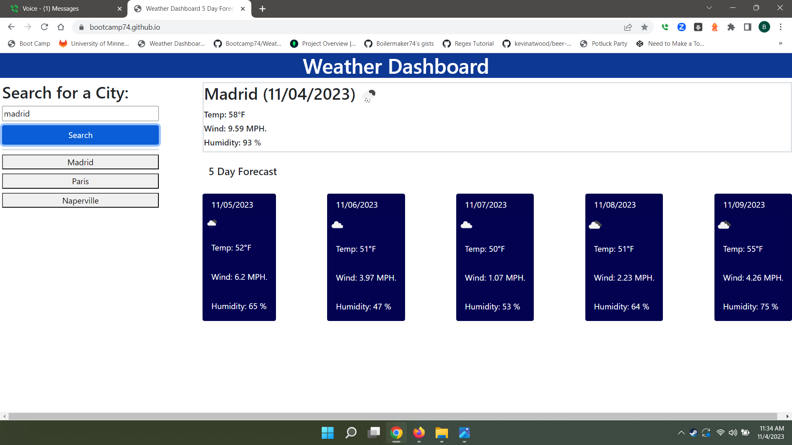
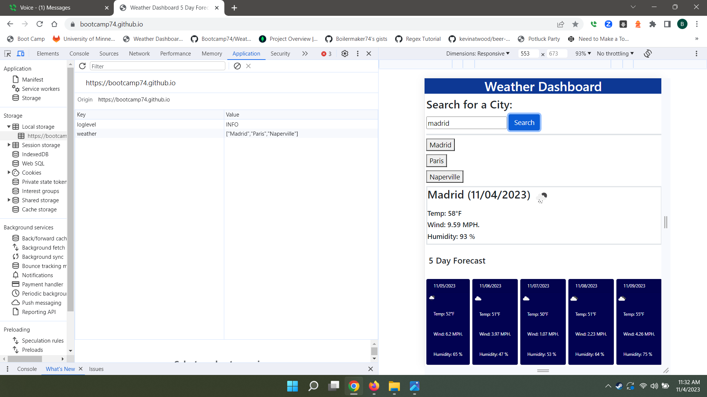
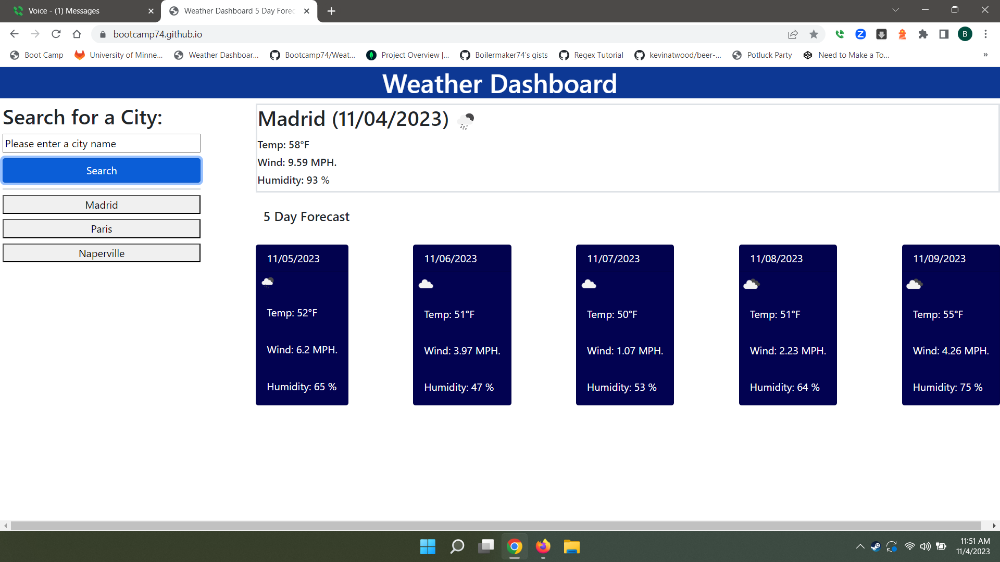

# Five Day weather forecast 
## Description
5 day weather forecaster is an application that displays the weather for any city the user requests. The current weather is displayed in a large, centered block along with five cards that display the anticipated weather for the next five days under the main box.

 

Past searches are retained in local memory. Only the last ten searches are retained. Once the past searches have reached ten city names, the new city’s name will be spliced into the array and the oldest item will be removed.

## Deployed Application URL
https://bootcamp74.github.io/
## Table of Contents
* [Installation](#installation)
* [Features](#features)
* [Languages and Technologies Used](#languages-and-technologies-used)
* [Dependencies](#dependencies)
* [How to Use This Application](#how-to-use-this-application)
* [Licenses](#Licenses)
* [Contributors](#contributors)
* [Testing](#testing)
* [Questions](#questions)
## Installation
No installation is necessary as it runs from the browser on the user's computer on url https://bootcamp74.github.io/

## Features
This application has some useful features. It will hold the user's searches in local memory.  

It will display previous searches on ten button which will populate as the user uses the application. 

The application is limited to ten buttons or past searches. Once the eleventh search is initiated, a new button is created and placed at the top of the list. The oldest search, which is at the bottton of the list is removed. If the user types a city name that is allready in the list, the list remains unchanged. Only new cities, which are not present in the list, are added with each new request.

If the user fails to type in a city in the search box, the message “Please enter a city name” will appear in the input box above the blue search button.

.

If the user types in an unknown city, the message “City not found. Please check spelling and try again” is displayed in the main display window. 

Lastly, if the network goes down or there is problem getting data from the site an error message with the appropriate code is displayed. 

 

## Languages and Technologies Used

## Dependencies
"inquirer": "^8.2.4
## How to Use This Application:
The project is run from the URL https://bootcamp74.github.io/ For the first search, the user must enter the desired city's name in the input box and then press the search button. Once a selection is made, the user's past choices are then recalled via a set of buttons that propagate under the search box. The user may either type in a city name or use the buttons that correspond to the city name to make future searches.
## Licenses

## Contributors
N/A
## Testing
N/A
## Questions
Please send your questions [here](mailto:bradm1492@gmain.com?subject=[GitHub]%20Dev%20Connect) or visit [github/boilermaker74](https://github.com/boilermaker74).

